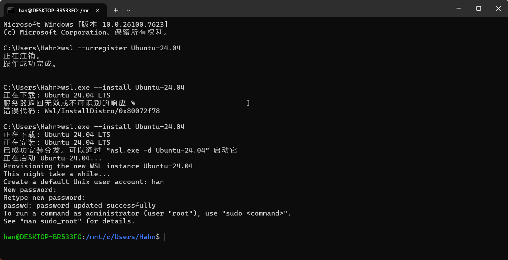
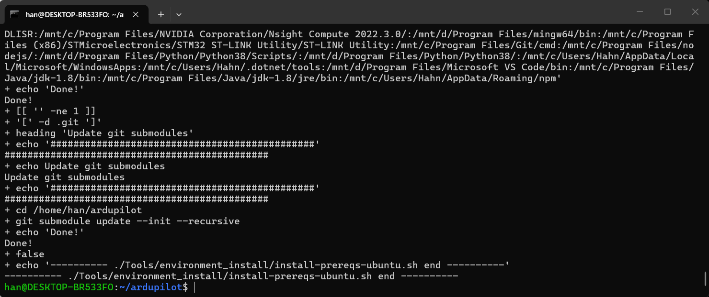
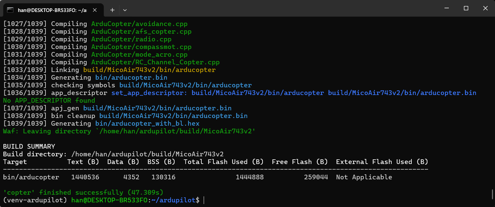

# APM 环境搭建及固件编译

> Hahngao 首次编辑于 2026/1/26

## 一、环境准备

### 1）安装 WSL2 + Ubuntu 24.04

- 在 Windows 11 终端执行（若重装可先注销旧发行版）：

```cmd
# 可选：仅在需要重装时执行
wsl --unregister Ubuntu-24.04

# 安装 Ubuntu 24.04
wsl.exe --install Ubuntu-24.04
```

- 安装后若未完成用户名/密码初始化，可手动进入一次：

```cmd
wsl.exe -d Ubuntu-24.04
```



> 说明：WSL 安装失败通常与网络或发行版状态有关。若反复失败，可先 `wsl --unregister` 后重装。

### 2）在 Ubuntu 中安装 Git 工具

在 Ubuntu 终端执行：

```bash
# 更新软件包索引
sudo apt update

# 升级已安装软件包
sudo apt upgrade -y

# 安装 Git 与图形化工具
sudo apt install -y git gitk git-gui
```

可选：缓存 Git 凭据（减少重复输入用户名密码）

```bash
git config --global credential.helper store
```

### 3）克隆 ArduPilot 源码

```bash
git clone https://github.com/ArduPilot/ardupilot.git
# 或 SSH(需要提前配置好密钥和公钥)：
git clone git@github.com:ArduPilot/ardupilot.git

cd ardupilot
```

> 使用https克隆代码仓库时，若因网络不稳定而无法克隆时建议使用 SSH 或重试多次。

### 4）使用 VS Code 连接 WSL 工作区（示例）

- VS Code 中使用 Remote - WSL 连接 `Ubuntu-24.04`
- 打开 `ardupilot` 目录（`File -> Open Folder`）
- ！本教程使用 `master` 分支进行 SITL 仿真相关开发

```bash
git checkout master
git pull
```

### 5）安装编译依赖

在 `ardupilot` 根目录执行，建议逐行运行：

```bash
sudo apt-get update
sudo apt-get install -y binutils-arm-none-eabi gcc-arm-none-eabi
git submodule update --init --recursive --force
chmod +x ./Tools/environment_install/install-prereqs-ubuntu.sh
./Tools/environment_install/install-prereqs-ubuntu.sh -y
. ~/.profile
```

如果某个子模块更新失败，可进入 `modules` 目录手动克隆，例如：

```bash
cd ~/ardupilot/modules
git clone https://github.com/ArduPilot/ChibiOS.git
```



- 推荐安装 `ARDUPILOT DEVENV` 扩展检查依赖是否完整。

## 二、编译 Copter 固件（以 MicoAir743v2 为例）

在 `ardupilot` 根目录执行。通常先清理，再配置目标板并编译：

```bash
./waf distclean
./waf configure --board MicoAir743v2
./waf copter -j4
```

> 对于需要自定义 Bootloader 的板卡，请先按板级文档完成 Bootloader 编译与烧录流程。




