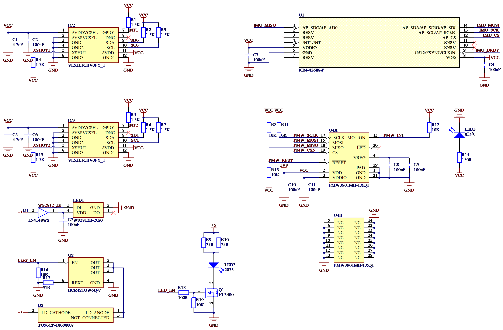

# AP Peripheral自定义固件编译与烧录

> *Jennifer Butler 编辑于 2026/1/23*

## 一、硬件说明

### 主要硬件

STM32G473CEU6、ICM-42688-P、WS2812、PMW3901MB、VL51L1CB

### 引脚定义表

| **MCU Pins** | **Net / Function** |              **Note**               |
| :----------: | :----------------: | :---------------------------------: |
|     PA0      |      Laser_EN      |   Control Laser With High Enable    |
|     PA1      |       LED_EN       |    Control LED With High Enable     |
|     PA2      |     WS2812_DI      |     WS2812 Control (TIM15_CH1)      |
|     PA3      |        PWM1        |     Servo 1 Control (TIM2_CH4)      |
|     PA4      |        PWM2        |     Servo 2 Control (TIM3_CH2)      |
|     PA5      |      IMU_SCLK      |   Connect to ICM42688 SCLK (SPI1)   |
|     PA6      |      IMU_MISO      |   Connect to ICM42688 MISO (SPI1)   |
|     PA7      |      IMU_MOSI      |   Connect to ICM42688 MOSI (SPI1)   |
|     PA8      |        SDA1        |  Connect to VL53L1CB 2 SDA (I2C2)   |
|     PA9      |        SCL1        |  Connect to VL53L1CB 2 SCL (I2C2)   |
|     PA10     |    VL53L1_INT2     |      Connect to VL53L1CB 2 INT      |
|     PA11     |       CAN_RX       |               FDCAN1                |
|     PA12     |       CAN_TX       |               FDCAN1                |
|     PA13     |       SWDIO        |           SWD Debug Data            |
|     PA14     |       SWCLK        |           SWD Debug Clock           |
|     PA15     |       MOS_2        | Control Power Out COM 2 (TIM8_CH1)  |
|     PB0      |      IMU_DRDY      |       Connect to ICM42688 INT       |
|     PB1      |        PWM3        |     Servo 3 Control (TIM3_CH4)      |
|     PB2      |        PWM4        |     Servo 4 Control (TIM5_CH1)      |
|     PB3      |        TXD         |    For Debug, Not used (USART2)     |
|     PB4      |        RXD         |    For Debug, Not used (USART2)     |
|     PB5      |       MOS_1        | Control Power Out COM 1 (TIM17_CH1) |
|     PB6      |    VL53L1_INT1     |      Connect to VL53L1CB 1 INT      |
|     PB7      |       XSHUT1       |     Connect to VL53L1CB 1 XSHUT     |
|     PB8      |        SCL0        |  Connect to VL53L1CB 1 SCL (I2C1)   |
|     PB9      |        SDA0        |  Connect to VL53L1CB 1 SDA (I2C1)   |
|     PB10     |      PMW_INT       |       Connect to PMW3901 INT        |
|     PB11     |      PMW_REST      |      Connect to PMW3901 RESET       |
|     PB12     |       PMW_CS       |        Connect to PMW3901 CS        |
|     PB13     |      PMW_SCLK      |   Connect to PMW3901 SCLK (SPI2)    |
|     PB14     |      PMW_MISO      |   Connect to PMW3901 MISO (SPI2)    |
|     PB15     |      PMW_MOSI      |   Connect to PMW3901 MOSI (SPI2)    |
|     PC4      |       IMU_CS       |       Connect to ICM42688 CS        |
|     PC6      |       XSHUT2       |     Connect to VL53L1CB 2 XSHUT     |
|     PF0      |       OSC IN       |       Connect to 8MHz Crystal       |
|     PF1      |      OSC OUT       |       Connect to 8MHz Crystal       |

### 原理图




## 二、步骤

### (一)环境准备

1. **安装WSL2 Ubuntu24.04**

   - 在 Windows 11 终端中输入以下命令安装

     ```cmd
     wsl.exe --install Ubuntu-24.04
     ```

2. **Windows 下安装 [VS Code](https://code.visualstudio.com/)**

3. **WSL2 Ubuntu 下安装 git gitk git-gui**

   - 在 Ubuntu 终端中输入以下命令安装

     ```bash
     sudo apt update
     sudo apt upgrade
     sudo apt install git gitk git-gui
     ```

4. **克隆项目源码**

   - 在 Ubuntu 终端中输入以下命令克隆

     ```bash
     git clone https://github.com/ArduPilot/ardupilot.git
     ```

5. **配置工作环境**
   - 在 VS Code 中点击`远程`按键，选择`WSL`，选择安装的 Ubuntu-24.04，等待目录切换完成
   - 在 VS Code 中 `File -> Open Folder` 打开 `ardupilot` 文件夹
   - 切换到 master 分支

6. **安装必要依赖**

   - 打开终端 (`Ctrl + ~`)

   -   输入以下命令安装依赖

       ```bash
       sudo apt-get update
       sudo apt-get install -y binutils-arm-none-eabi gcc-arm-none-eabi
       chmod 777 ./Tools/environment_install/install-prereqs-ubuntu.sh
       ./Tools/environment_install/install-prereqs-ubuntu.sh -y
       . ~/.profile
       ```

   -   等待终端输出

       ```bash
       ---------- ./Tools/environment_install/install-prereqs-ubuntu.sh end ----------
       ```

       依赖安装成功

   -   强烈建议安装 `ARDUPILOT DEVENV` 扩展以检查依赖和工具是否齐全

### (二)创建硬件配置文件并修正固件 Bug

1. 在`AP_HAL_ChibiOS/hwdef`文件夹下创建`AP_G473_Node`文件夹

2. 在`AP_G473_Node`文件夹中创建`hwdef-bf.dat`和`hwdef.dat`2个文件

3. 在`hwdef-bl.dat`中填入

   ```ini
   MCU STM32G474 STM32G474xx
   
   OSCILLATOR_HZ 8000000
   
   APJ_BOARD_ID 1099
   
   define HAL_RAM_RESERVE_START 0
   
   FLASH_SIZE_KB 512
   FLASH_RESERVE_START_KB 0
   FLASH_BOOTLOADER_LOAD_KB 32
   APP_START_OFFSET_KB 4
   
   # ---------------------------------------------
   # LED Control
   # Using PA1 as Bootloader Status LED. 
   # Active High based on "Control LED With High Enable"
   PA1 LED_BOOTLOADER OUTPUT LOW
   define HAL_LED_ON 1
   
   # SWD debugging
   PA13 SWDIO SWD
   PA14 SWCLK SWD
   
   # CAN Support (FDCAN1)
   PA11 CAN1_RX CAN1
   PA12 CAN1_TX CAN1
   
   # ---------------------------------------------
   # Safety: Ensure critical pins are safe during boot
   
   # Deselect SPI Devices
   PB12 FLOW_CS CS
   PC4  IMU_CS CS
   
   # Ensure Power Outputs are OFF
   PA0  LASER_EN OUTPUT LOW
   PA15 MOS_2    OUTPUT LOW
   PB5  MOS_1    OUTPUT LOW
    
   # Setting Low keeps them off/reset.
   PB7  RANGEFINDER1_XSHUT OUTPUT LOW
   PC6  RANGEFINDER2_XSHUT OUTPUT LOW
   
   # ---------------------------------------------
   # Bootloader Settings
   
   # Debug UART (USART2 PB3/PB4)
   PB3 USART2_TX USART2
   PB4 USART2_RX USART2
   
   # make bl baudrate match debug baudrate for easier debugging
   define BOOTLOADER_BAUDRATE 115200
   
   # use a small bootloader timeout
   define HAL_BOOTLOADER_TIMEOUT 2500
   # allow for bootloader to wait indefinitely if valid app not found
   define HAL_BOOTLOADER_TIMEOUT 2500
   
   define HAL_USE_EMPTY_IO TRUE
   define DMA_RESERVE_SIZE 0
   
   define HAL_USE_SERIAL TRUE
   ```

4. 在`hwdef.dat`中填入

   ```ini
   MCU STM32G474 STM32G474xx
   
   FLASH_RESERVE_START_KB 36
   FLASH_SIZE_KB 512
   
   STORAGE_FLASH_PAGE 16
   define HAL_STORAGE_SIZE 1800
   
   # ChibiOS system timer
   STM32_ST_USE_TIMER 4
   define CH_CFG_ST_RESOLUTION 16
   
   # Disable ADC as no pins are assigned
   define HAL_USE_ADC FALSE
   
   # board ID
   APJ_BOARD_ID 1099
   
   OSCILLATOR_HZ 8000000
   
   # Enable AP_Peripheral
   env AP_PERIPH 1
   
   # Safe defaults for a peripheral node (Save flash and RAM)
   define AP_AHRS_ENABLED 0
   define HAL_NAVEKF2_AVAILABLE 0
   define HAL_NAVEKF3_AVAILABLE 0
   # Configure AP_Peripheral features
   define AP_PERIPH_GPS_ENABLED 1
   define AP_PERIPH_BARO_ENABLED 1
   define AP_PERIPH_MAG_ENABLED 1
   define AP_PICCOLOCAN_ENABLED 0
   define AP_RSSI_ENABLED 0
   define AP_TUNING_ENABLED 0
   define AP_SCRIPTING_ENABLED 0
   define AP_MOTORS_ENABLED 0
   define AC_AUTOROTATION_ENABLED 0
   define AC_AUTOTUNE_ENABLED 0
   define AP_RC_CHANNEL_ENABLED 0
   define AP_NAVIGATION_ENABLED 0
   # Enable Rangefinder and Optical Flow
   define AP_PERIPH_RANGEFINDER_ENABLED 1
   define AP_PERIPH_OPTICALFLOW_ENABLED 1
   define AP_PERIPH_NEOPIXEL_ENABLED 1
   
   define SERIAL_BUFFERS_SIZE 256
   define DMA_RESERVE_SIZE 2048
   
   # Bootloader compression
   env ROMFS_UNCOMPRESSED True
   
   # Disable bootloader flashing to bypass missing bootloader binary check during config
   define AP_BOOTLOADER_FLASHING_ENABLED 0
   
   # ----------------- GPIO Limits -----------------
   # PA0 Laser_EN
   PA0 LASER_EN OUTPUT LOW
   # PA1 LED_EN
   PA1 FLOW_LED_EN OUTPUT LOW
   
   # PA2 WS2812
   # Mapped to PWM channel 5 (Index 4) for NeoPixel driver
   PA2 TIM15_CH1 TIM15 PWM(5) GPIO(54)
   
   # PA3 PWM1 (Servo 1) TIM2_CH4
   PA3 TIM2_CH4 TIM2 PWM(1) GPIO(50)
   # PA4 PWM2 (Servo 2) TIM3_CH2
   PA4 TIM3_CH2 TIM3 PWM(2) GPIO(51)
   
   # PA5-7 SPI1 (IMU)
   PA5 SPI1_SCK SPI1
   PA6 SPI1_MISO SPI1
   PA7 SPI1_MOSI SPI1
   
   # PA8-9 I2C2 (VL53L1CB #2)
   PA8 I2C2_SDA I2C2
   PA9 I2C2_SCL I2C2
   
   # PA10 VL53L1_INT2
   PA10 RANGEFINDER2_INT INPUT
   
   # PA11-12 CAN
   PA11 CAN1_RX CAN1
   PA12 CAN1_TX CAN1
   
   # PA13-14 SWD
   PA13 SWDIO SWD
   PA14 SWCLK SWD
   
   # PA15 MOS_2 (Power Out COM 2) TIM8_CH1
   # Defined as GPIO/Relay for simple control
   PA15 MOS_2 OUTPUT LOW
   
   # PB0 IMU_DRDY
   PB0 IMU_INT INPUT
   
   # PB1 PWM3 (Servo 3) TIM3_CH4
   PB1 TIM3_CH4 TIM3 PWM(3) GPIO(52)
   # PB2 PWM4 (Servo 4) TIM5_CH1
   PB2 TIM5_CH1 TIM5 PWM(4) GPIO(53)
   
   # PB3-4 UART2 (Debug)
   PB3 USART2_TX USART2
   PB4 USART2_RX USART2
   
   # PB5 MOS_1 (Power Out COM 1) TIM17_CH1
   PB5 MOS_1 OUTPUT LOW
   
   # PB6 VL53L1_INT1
   PB6 RANGEFINDER1_INT INPUT
   # PB7 XSHUT1
   PB7 RANGEFINDER1_XSHUT OUTPUT HIGH
   
   # PB8-9 I2C1 (VL53L1CB #1)
   PB8 I2C1_SCL I2C1
   PB9 I2C1_SDA I2C1
   
   # PB10 PMW_INT
   PB10 FLOW_INT INPUT
   # PB11 PMW_REST
   PB11 FLOW_RST OUTPUT HIGH
   # PB12 FLOW_CS
   PB12 FLOW_CS CS
   
   # PB13-15 SPI2 (PMW3901)
   PB13 SPI2_SCK SPI2
   PB14 SPI2_MISO SPI2
   PB15 SPI2_MOSI SPI2
   
   # PC4 IMU_CS
   PC4 IMU_CS CS
   
   # PC6 XSHUT2
   PC6 RANGEFINDER2_XSHUT OUTPUT HIGH
   
   # PF0-1 OSC
   # PF0 OSC_IN OSC
   # PF1 OSC_OUT OSC
   
   # ----------------- Peripherals -----------------
   
   # Order
   I2C_ORDER I2C1 I2C2
   SERIAL_ORDER USART2
   
   # IMU (ICM42688 on SPI1)
   SPIDEV icm42688 SPI1 DEVID1 IMU_CS MODE3 2*MHZ 8*MHZ
   IMU ICM42688 SPI:icm42688 ROTATION_NONE
   
   # Optical Flow (PMW3901 on SPI2)
   SPIDEV pmw3901 SPI2 DEVID1 FLOW_CS MODE3 2*MHZ 2*MHZ
   
   # Rangefinders (VL53L1CB on I2C1 and I2C2)
   define RANGEFINDER_MAX_INSTANCES 2
   define HAL_USE_I2C TRUE
   # We will set parameters RNGFND1_TYPE and RNGFND2_TYPE to VL53L1
   
   # Servos
   define AP_PERIPH_SERVO_ENABLED 1
   
   # User Pins (Relays)
   define AP_PERIPH_RELAY_ENABLED 1
   define AP_RELAY_NUM_RELAYS 4
   # Relay 1 -> LASER_EN (PA0)
   # Relay 2 -> FLOW_LED_EN (PA1)
   # Relay 3 -> MOS_1 (PB5)
   # Relay 4 -> MOS_2 (PA15)
   
   # WS2812
   define AP_PERIPH_NEOPIXEL_COUNT 1
   # Channel 4 (0-based) = PWM(5) = PA2
   define HAL_PERIPH_NEOPIXEL_CHAN 4
   
   # CAN
   define HAL_CAN_POOL_SIZE 4000
   
   define HAL_NO_UART_DRIVER 0
   ```

5. 修改`Tools/AP_Bootloader/can.cpp`适配`DroneCAN/libcanard`子模块底层 API 参数变化

   - 修正 handle_get_node_info 函数中的 canardRequestOrRespond 调用

     ```c++
     static void handle_get_node_info(CanardInstance* ins,
                                      CanardRxTransfer* transfer)
     {
         // ... (前略)
         uint16_t total_size = uavcan_protocol_GetNodeInfoResponse_encode(&pkt, buffer, true);
     
         canardRequestOrRespond(ins,
                                transfer->source_node_id,
                                UAVCAN_PROTOCOL_GETNODEINFO_SIGNATURE,
                                UAVCAN_PROTOCOL_GETNODEINFO_ID,
                                &transfer->transfer_id,
                                transfer->priority,
                                CanardResponse,
                                &buffer[0],
                                total_size
     #if CANARD_ENABLE_DEADLINE
                                ,0
     #endif
     #if CANARD_MULTI_IFACE
                                ,0xFF
     #endif
                                );
     }
     ```

   - 修正 send_fw_read 函数中的 canardRequestOrRespond 调用

     ```c++
     static bool send_fw_read(uint8_t idx)
     {
         // ... (前略)
         if (canardRequestOrRespond(&canard,
                                    fw_update.node_id,
                                    UAVCAN_PROTOCOL_FILE_READ_SIGNATURE,
                                    UAVCAN_PROTOCOL_FILE_READ_ID,
                                    &fw_update.transfer_id,
                                    CANARD_TRANSFER_PRIORITY_HIGH,
                                    CanardRequest,
                                    &buffer[0],
                                    total_size
     #if CANARD_ENABLE_DEADLINE
                                    ,0
     #endif
     #if CANARD_MULTI_IFACE
                                    ,0xFF
     #endif
                                    ) > 0) {
             // ... (后略)
         }
         return false;
     }
     ```

   - 修正 handle_begin_firmware_update 函数中的 canardRequestOrRespond 调用

     ```c++
     static void handle_begin_firmware_update(CanardInstance* ins, CanardRxTransfer* transfer)
     {
         // ... (前略)
         uint32_t total_size = uavcan_protocol_file_BeginFirmwareUpdateResponse_encode(&reply, buffer, true);
         canardRequestOrRespond(ins,
                                transfer->source_node_id,
                                UAVCAN_PROTOCOL_FILE_BEGINFIRMWAREUPDATE_SIGNATURE,
                                UAVCAN_PROTOCOL_FILE_BEGINFIRMWAREUPDATE_ID,
                                &transfer->transfer_id,
                                transfer->priority,
                                CanardResponse,
                                &buffer[0],
                                total_size
     #if CANARD_ENABLE_DEADLINE
                                ,0
     #endif
     #if CANARD_MULTI_IFACE
                                ,0xFF
     #endif
                                );
     }
     ```

   - 修正 canard_broadcast 包装函数

     ```c++
     static void canard_broadcast(uint64_t data_type_signature,
                                  uint16_t data_type_id,
                                  uint8_t &transfer_id,
                                  uint8_t priority,
                                  const void* payload,
                                  uint16_t payload_len)
     {
     #if CH_CFG_USE_MUTEXES == TRUE
         WITH_SEMAPHORE(can_mutex);
     #endif
         canardBroadcast(&canard,
                         data_type_signature,
                         data_type_id,
                         &transfer_id,
                         priority,
                         payload,
                         payload_len
     #if CANARD_ENABLE_DEADLINE
                         ,0
     #endif
     #if CANARD_MULTI_IFACE
                         ,0xFF
     #endif
                         );
     }
     ```

   - 在末尾添加缺失的内存分配信号量函数

     ```c++
     extern "C" {
         void canard_allocate_sem_take(CanardPoolAllocator *allocator) {
             (void)allocator;
         }
         void canard_allocate_sem_give(CanardPoolAllocator *allocator) {
             (void)allocator;
         }
     }
     ```

### (三)编译 Boot loader 以及 AP Peripheral 固件

在终端中输入以下命令，首先清理环境，然后配置并编译 Bootloader，最后编译 AP Peripheral 固件,构建系统将会自动将 Bootloader 打包进固件中

```bash
./waf distclean
./waf configure --board AP_G473_Node --bootloader && ./waf --targets bootloader/AP_Bootloader
cp build/AP_G473_Node/bin/AP_Bootloader.bin Tools/bootloaders/AP_G473_Node_bl.bin
./waf configure --board AP_G473_Node && ./waf AP_Periph
```

等待编译结束，终端打印类似以下信息即表示成功

```bash
Applying APP_DESCRIPTOR 26e957fa0043f2d2 to elf
[878/880] apj_gen build/AP_G473_Node/bin/AP_Periph.bin
[879/880] bin cleanup build/AP_G473_Node/bin/AP_Periph.bin
[880/880] Generating bin/AP_Periph_with_bl.hex
Waf: Leaving directory `/home/jennifer/ardupilot/build/AP_G473_Node'

BUILD SUMMARY
Build directory: /home/jennifer/ardupilot/build/AP_G473_Node
Target         Text (B)  Data (B)  BSS (B)  Total Flash Used (B)  Free Flash (B)  External Flash Used (B)
---------------------------------------------------------------------------------------------------------
bin/AP_Periph    190439       764    30080                191203          296164  Not Applicable         

'AP_Periph' finished successfully (14.047s)
```

## 三、烧录固件

- 使用 ST-Link 或者 J-Link 和 4Pin 1.5mm 间距 PCB 测试夹连接节点板与电脑，确保节点板已经上电
  - 打开 `STM32CubeProgrammer`，点击 `Connect` 连接
  - 通过 `Open File` 加载生成的固件文件 `AP_Periph_with_bl.hex`
  - 点击 `Download` 烧录
  - 重启飞控板

## 四、调试

1. 状态灯反馈

   - 蓝色呼吸/闪烁: 系统正在初始化或处于 Bootloader 模式

   - 橙色: 初始化完成，但未检测到 CAN 总线连接
   - 绿色: CAN 总线通信正常，已连接到飞控
   - 红色: 发生错误或故障

2. 调试串口

   - 连接 UART2 串口，配置串口助手波特率为`57600`

   - 显示以下启动信息则为正常

     ```bash
     AP_Periph: Init
     CAN: Initializing...
     Param: Init
     Baro: detected...
     Mag: detected...
     ```

     

