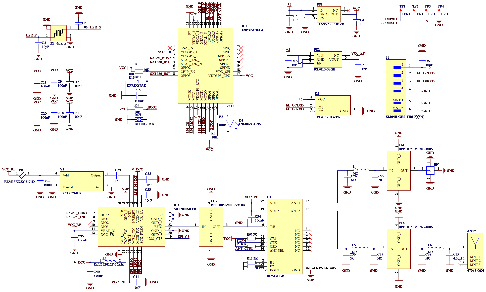

# ExpressLRS 接收机自定义固件编译与烧录

> *Jennifer Butler 编辑于 2026/1/23*
## 一、硬件说明

### 主要硬件

ESP32-C3FH4、SX1280、SE2431L

### 引脚定义表

| MCU Pins | 功能 | Note |
| :---: | :---: | :---: |
| GPIO 20 | RX | Debug/CRSF RX(UART0) |
| GPIO 21 | TX | Debug/CRSF TX(UART0) |
| GPIO 0 | BUSY | S1280 BUSY |
| GPIO 1 | DIO1 | SX1280 INT |
| GPIO 3 | RST | SX1280 Reset |
| GPIO 4 | NSS | SPI CS |
| GPIO 5 | MOSI | SPI MOSI |
| GPIO 6 | SCK | SPI SCK |
| GPIO 7 | MISO | SPI MISO |
| GPIO 10 | LED | State LED(Active LOW) |
| GPIO 19 | TXEN | SE2431 CTX (PA Enable) |
| GPIO 18 | ANT_CTRL| SE2431 ANT SEL |

### 原理图



## 二、步骤

### （一）环境准备

1.  **安装 [VS Code](https://code.visualstudio.com/)**
2.  **安装 PlatformIO 插件**
    *   打开 VS Code
    *   点击左侧边栏的扩展图标
    *   搜索 `PlatformIO IDE` 并安装
    *   安装完成后，重启 VS Code，耐心等待 PlatformIO 初始化完成
3.  **安装 [Git](https://git-scm.com/)** 
    注意安装时勾选“添加到系统环境变量”

### （二）获取源码

1.  选择一个工作文件夹，并在工作文件夹中打开 VS Code
2.  打开终端 (`Ctrl + ~`)
3.  输入以下命令拉取 ExpressLRS 源码
    ```powershell
    git clone https://github.com/ExpressLRS/ExpressLRS.git
    ```
    注意：如果已经有源码，直接在 VS Code 中 `File -> Open Folder` 打开 `ExpressLRS` 文件夹即可
    
4. 切换到master分支

### （三）硬件定义

#### （1）创建引脚配置文件

1.  在项目目录下，进入 `src/hardware/RX` 文件夹
2.  创建一个新文件，命名为 `DIY C3 2400 SX1280 PA.json`
3.  将以下内容复制进去并保存

```json
{
    "serial_rx": 20,
    "serial_tx": 21,
    "radio_busy": 0,
    "radio_dio1": 1,
    "radio_rst": 3,
    "radio_nss": 4,
    "radio_mosi": 5,
    "radio_sck": 6,
    "radio_miso": 7,
    "power_txen": 19,
    "ant_ctrl": 18,
    "led": 10,
    "led_active_low": true,
    "domain": 0
}
```

#### （2）注册目标器件

1.  打开 `src/hardware/targets.json`
2.  搜索 `"diy": {`，找到 DIY 设备区域
3.  在 `"rx_2400": {` 下方，添加设备配置

```json
        "rx_2400": {
            "diy_c3_sx1280_pa": {
                "product_name": "DIY ESP32-C3 SX1280 PA RX",
                "lua_name": "DIY C3 2400 RX",
                "layout_file": "DIY C3 2400 SX1280 PA.json",
                "upload_methods": ["uart", "wifi", "betaflight"],
                "min_version": "3.3.0",
                "platform": "esp32-c3",
                "firmware": "Unified_ESP32C3_2400_RX"
            },
            // 其他配置...
```

## 三、修改用户配置

1.  打开 `src/user_defines.txt`
2.  修改以下内容（根据需要取消注释）

```ini
### BINDING PHRASE ###
# 设置绑定短语，必须与发射头一致
-DMY_BINDING_PHRASE="your_secret_phrase"

### REGULATORY DOMAIN ###
-DRegulatory_Domain_ISM_2400

### PERFORMANCE OPTIONS ###
-DLOCK_ON_FIRST_CONNECTION

### DEBUGGING ###
-DDEBUG_LOG
-DDEBUG_LOG_VERBOSE
```
3.  更多配置选项参考 [ExpressLRS 官方 Wiki](https://www.expresslrs.org/software/user-defines/)

## 四、修正已知 Bug

在某些版本源码中，存在一个变量名未更新的 Bug，必须手动修复才能编译通过。

1.  打开文件 `src/lib/CrsfProtocol/CRSFEndpoint.cpp`
2.  搜索 `case CRSF_FRAMETYPE_PARAMETER_READ:`
3.  找到这行代码
    ```cpp
    DBGVLN("Read parameter %u %u", fieldId, fieldChunk);
    ```
4.  修改为
    ```cpp
    DBGVLN("Read parameter %u %u", parameterIndex, parameterArg);
    ```
5.  保存文件

## 五、编译与选择配置

1.  在 VS Code 左侧点击 PlatformIO 图标 
2.  在 Project Tasks 列表中，展开 `Unified_ESP32C3_2400_RX_via_UART`
3.  点击 Build
4.  如果是第一次运行，它会自动安装依赖库，可能会提示缺少 `intelhex` 等。如果报错，请在终端运行
    ```powershell
    pip install intelhex
    ```
    然后重新点击 Build。
5.  在编译最后阶段，终端会出现一个列表，列出所有支持的硬件配置，并提示 `Choose a configuration to load...`
    *   找到刚才添加的 **DIY ESP32-C3 SX1280 PA RX**
    *   在终端输入对应的数字，按回车
6.  等待显示 `[SUCCESS]`

## 六、刷入固件

### 准备工作
1.   将 USB-TTL 模块连接到 ESP32-C3
    *   TTL TX -> ESP32 UART0 RX   
    *   TTL RX -> ESP32 UART0 TX   
    *   GND -> GND  
    *   3.3V -> 3.3V  
2.   进入 Boot 模式：先短接 BOOT 断点调试焊盘，然后上电，断开断点调试焊盘

### 开始刷写

在 PlatformIO 菜单 `Unified_ESP32C3_2400_RX_via_UART` 下，点击 "Upload"

或者，在终端运行以下命令（修改 COMx 为实际连接端口）

```powershell
python python/esptool.py --chip esp32c3 --port COM3 --baud 460800 --before default_reset --after hard_reset write_flash -z --flash_mode dio --flash_freq 40m --flash_size 4MB 0x0 .pio/build/Unified_ESP32C3_2400_RX_via_UART/firmware.bin
```

## 七、调试

1.  刷写完成后，打开串口监视器

2.  将波特率设为 `420000`

3.  接收机重新上电

4.  观察日志
    *   `[Init] JSON: OK` -> 硬件配置加载成功
    
    *   `[Init] SX1280: PASS` -> 射频芯片通信正常
    
    *   `State: DISCONNECTED` / `CONNECTED` -> 接收机正在工作
    
5. 调试完成后可在`user_define`中注释调试选项以提高性能
