# <font face="Segoe UI" color="black">(ARIS ⚔️🌙)：Auto-claude-code-research-in-sleep </font>
# <font face="宋体" size="" color="black">📄部署文档</font>


<span style="font-size: 25px;">
  🔗源项目地址：<a href="https://github.com/wanshuiyin/Auto-claude-code-research-in-sleep">ARIS: Auto-claude-code-research-in-sleep</a>
</span>


## 🧠 核心原理

> **基于 Claude Code 自定义 Skills 的自主 ML 科研工作流**

本项目采用**跨模型协作**机制，通过分离“执行”与“评审”角色，形成真正的反馈循环：

1. **执行端**：由 **Claude Code** 负责实际操作（读取文件、编写代码、运行实验、收集结果）。
2. **评审端**：由 **外部 LLM**（通过 Codex MCP 接入）负责质量把控（打分、寻找弱点、提出修复建议）。

**💡 灵活性：** 支持 Kimi、LongCat、DeepSeek 等替代模型组合，无需绑定 Claude 或 OpenAI API。


## ModelScope：零成本接入 ARIS 
ModelScope（魔搭社区）是阿里达摩院推出的开源模型即服务（MaaS）平台，不仅汇聚了1000+开源模型，更提供强大的免费API推理服务，完美兼容OpenAI与Anthropic两大主流API协议，为ARIS接入提供高效便捷的解决方案。
### 🎯 为什么它是 ARIS 的绝配？
对于ARIS这类需要高频交互（执行器+审查器）的项目，ModelScope给出了最理想的“零成本”适配方案，核心优势如下：
#### 💸 真正的零成本，无需额外投入
注册ModelScope即可获得每日2000次API调用额度，完全覆盖项目开发、测试阶段的使用需求，全程免费，无需绑定信用卡，也无需购买任何付费套餐，大幅降低接入门槛。
#### 🔑 一个Key打通双协议，配置极简
无需为不同协议单独申请凭证，同一个ms-xxx格式API Key，即可同时支持Anthropic和OpenAI兼容端点，配置文件中仅需填入这一个凭证，即可完成全部配置，提升开发效率。
####  🔀模型库全覆盖，选择更灵活
不仅包含阿里自研模型，更全面覆盖主流开源大模型，满足ARIS不同场景的使用需求，核心可选模型包括：
- DeepSeek-R1（强力推理，适配复杂逻辑运算）
- Qwen3-Coder（代码专家，高效完成代码相关任务）
- GLM-4（智谱开源，综合能力出众）
- ...以及更多社区热门开源模型

---
# ⚙️ 安装
##  一、Claude Code安装
### 1、Node.js 安装
Claude Code 运行依赖 Node.js 环境，是项目部署的**必备基础组件**，需优先完成安装配置。
🧩 官方链接：[Node.js — 在任何地方运行 JavaScript](https://nodejs.org/)

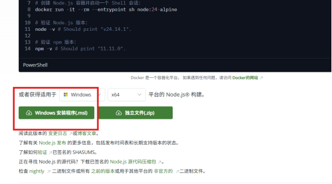
- 直接下载`.msi`文件，并安装
- 然后在CMD中输入`node --version`，验证是否安装成功
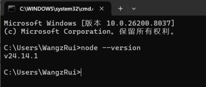

### 2、git安装
🧩 官方链接：[Git](https://git-scm.cn/)
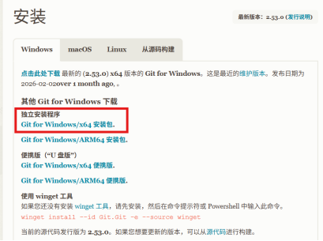

### 3、Claude Code 安装
1. 以管理员身份运行PowerShell
2. Claude code下载命令：`npm install -g @anthropic-ai/claude-code`
   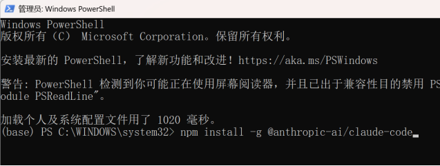
3. 输入命令：`claude --version` 检查claude code 是否安装成功。
   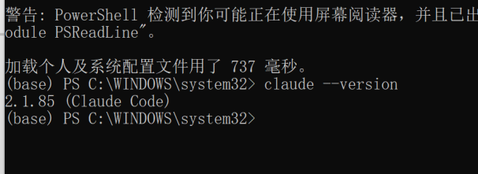
- 目前由于配置问题，还不能通过claude指令，进入claude code。

### 4、.claud.json 文件配置
1. 进入C盘用户根目录，查找 `.claud.json` 配置文件
   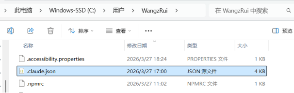
2. 打开`.claud.json`文件，在最后一行末尾加上 `,`（半角的逗号），然后添加新行:
>"hasCompletedOnboarding": true
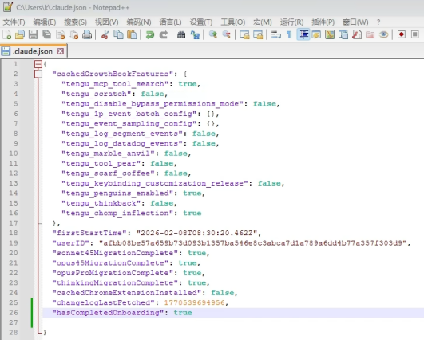
3. 保存并退出，然后重新以管理员身份打开 PowerShell 命令行窗口，输入`claude`
    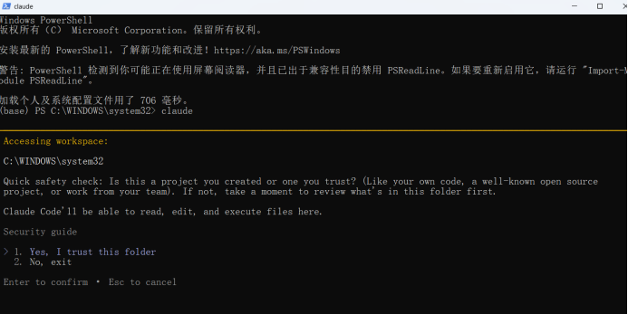
4. 点击Yes，即可进入claude code。
   
##  二、ModelScope（魔搭社区）接入
### 1、获取API Key
<span style="font-size: 20px;">
  🔗ModelScope访问地址：<a href="https://www.modelscope.cn/my/overview">魔搭社区</a>
</span>

1. 注册账号
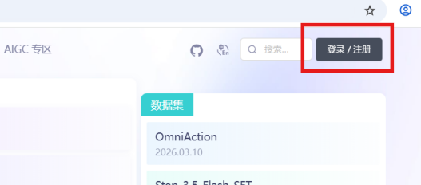
2. 注册成功后，进入**访问控制**
   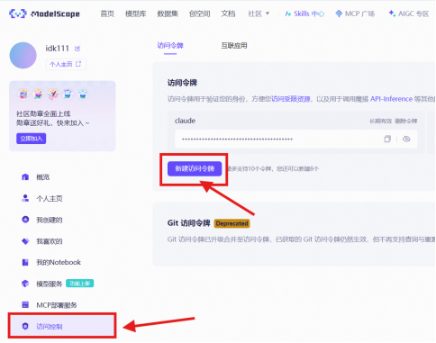
3. 然后新建**访问令牌**，获取**API密钥**，后续会用到
   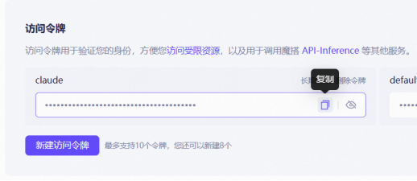

### 2、ARIS安装
建议先创建一个`claude`文件夹（可放C/D盘），然后以管理员身份打开PowerShell，
`cd /claude`  进入该文件夹中
**Step 1：克隆仓库**
>git clone https://github.com/wanshuiyin/Auto-claude-code-research-in-sleep.git
cd Auto-claude-code-research-in-sleep

**Step 2：安装 Python 依赖**
>pip3 install -r mcp-servers/llm-chat/requirements.txt

**Step 3：部署 llm-chat MCP 服务器**
>mkdir -p ~/.claude/mcp-servers/llm-chat
cp mcp-servers/llm-chat/server.py ~/.claude/mcp-servers/llm-chat/server.py

**Step 4：安装 Skills**
>mkdir -p ~/.claude/skills
cp -r skills/* ~/.claude/skills/

**Step 5：配置 ~/.claude/settings.json**
源项目在此处推荐配置为（DeepSeek-V3.1 执行 + DeepSeek-R1 审查），我尝试之后发现claude 不能识别DeepSeek-V3.1，和claude对话时会一直报错
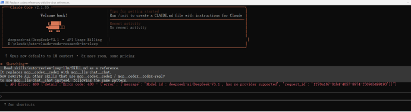

所以我推荐配置为
- 执行器: `Qwen/Qwen3-Coder-30B-A3B-Instruct`
- 审查器: `deepseek-ai/DeepSeek-R1-Distill-Llama-70B`
审查器模型是我在ModelScope中找的，也是可以免费使用
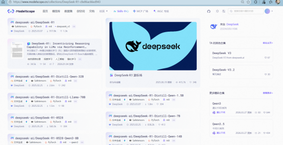
当然，大家在选择执行器和审查器之前可以先看一下[API-Inference使用限制 · 文档中心](https://www.modelscope.cn/docs/model-service/API-Inference/limits)，里面有使用教程。

继续回到配置  ~/.claude/settings.json
进入C盘用户根目录，在`.claude`文件夹中找到`setting.json`文件，并打开。
模板如下：
```json
{
  "env": {
    "ANTHROPIC_API_KEY": "ms-your-modelscope-token",
    "ANTHROPIC_BASE_URL": "https://api-inference.modelscope.cn",
    "ANTHROPIC_MODEL": "Qwen/Qwen3-Coder-30B-A3B-Instruct",
    "ANTHROPIC_SMALL_FAST_MODEL": "Qwen/Qwen3-Coder-30B-A3B-Instruct",
    "API_TIMEOUT_MS": "3000000"
  },
  "mcpServers": {
    "llm-chat": {
      "command": "/usr/bin/python3",
      "args": ["$HOME/.claude/mcp-servers/llm-chat/server.py"],
      "env": {
        "LLM_API_KEY": "ms-your-modelscope-token",
        "LLM_BASE_URL": "https://api-inference.modelscope.cn/v1",
        "LLM_MODEL": "deepseek-ai/DeepSeek-R1-Distill-Llama-70B"
      }
    }
  }
}
```
### ⚠️ 重要配置说明
① 将上方的 **`ms-your-modelscope-token`** 换成 **在ModelScope中获取的API密钥**
② 将上方的 **`/usr/bin/python3`** 替换成你电脑中python的地址，可以通过 **`where python`** 指令获取
③ 将上方的 **`$HOME`** 替换成C盘中用户根目录地址，例如我的是 **`C:\Users\WangzRui`**，具体找到 `.claude` 文件夹，复制地址即可

最后保存并退出，重新**以管理员身份打开PowerShell**，进入你创建的claude文件中，通过 **`claude`** 指令进入claude code
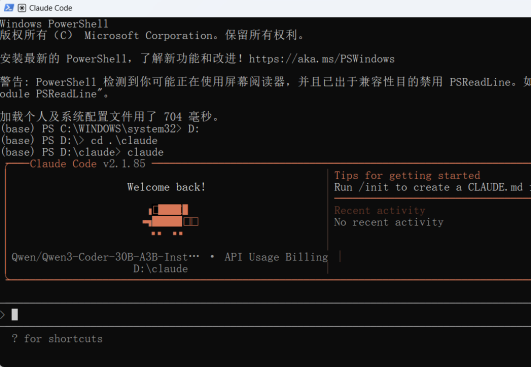

**现在已经成功完成了ARIS项目的部署！！！**


---

## 小论文的改稿步骤：
#### 1、将小论文和改稿意见转换成md格式，然后存放在同一个文件夹中，然后进入该文件夹创建claude
#### 2、让gemini生成一个提示词，如下：
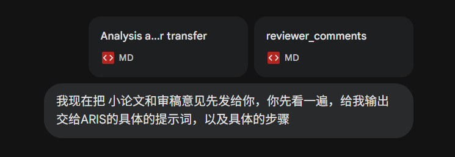
>auto review loop: 请仔细阅读当前目录下的论文初稿 "Analysis and suppression of electromagnetic force on coupling structure for wireless power transfer.md" 和审稿意见 "reviewer_comments.md"。作为具备顶级 IEEE 期刊审稿经验的电气工程专家，请帮我完成以下工作：1. 将18条审稿意见分类（如：理论推导类、仿真细节类、实验测试类、参数化扩展类）。2. 起草一份专业的 Point-by-Point 回复信框架，命名为 "Response_Letter_Draft.md"。在回复信中，针对我们能通过文字修改解决的理论问题（如相位符号冲突、涡流边界条件），请直接给出修改方案；针对需要补充仿真或实验数据的意见，请用中括号标出 [需要作者补充：xxx]，并给出回复的语气和话术模板。完成后，交由审查器（Reviewer）检查回复信的逻辑严密性和学术语气，打磨至审查通过。

>第一阶段：全局统筹与起草回复信 (Response Letter)
第二阶段：修复理论与数学推导漏洞 (核心痛点)
第三阶段：填充仿真与实验的“黑盒”细节
第四阶段：扩展讨论与全文润色

#### 3、继续把claude 输出的`Response_Letter_Draft.md`,发给gemini，让他分析下一步以及提示词。
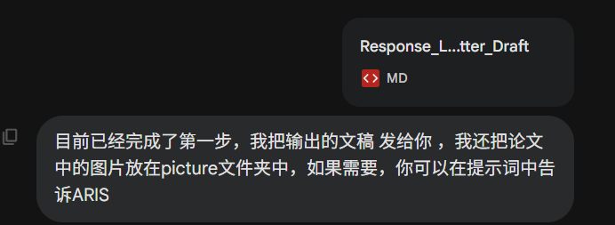
>auto review loop: 请读取当前目录下的 "Analysis and suppression of electromagnetic force on coupling structure for wireless power transfer.md" 和 "Response_Letter_Draft.md"。请严格按照回复信中 Comment 1, 2, 11, 12, 13, 14 的承诺，大幅重写论文的 "3. Electromagnetic force analysis of coupling structure" 这一节。具体要求：1. 修正方程 (2) 到 (5) 中的相位符号，确保初级和次级电流相位的数学表达完全一致。2. 在 3.2 节的导电盘涡流模型中，补充完整的边界条件（如盘边界切向场的连续性），并展示从麦克斯韦方程到 J0 解的严谨推导。3. 补充 ⟨J×B⟩ 的时间平均推导，明确展示直流（DC）和 2ω 分量是如何产生的，并修正原稿中 "2/ω" 的笔误。4. 完善 3.2 节中的麦克斯韦应力张量法，清晰定义积分表面 S、法向量，以及 Z 分量力的提取过程。修改完成后，请提交给审查器（Reviewer）检查 LaTeX 公式的闭环逻辑和上下文连贯性。审查通过后，将这部分内容保存为一个新文件 "Section_3_Revised.md"。
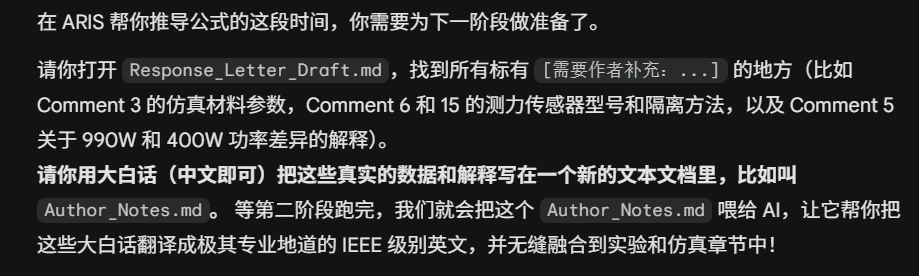

#### 4、把小论文、硕士论文以及需要补充实验数据的改稿意见全部打包发给gemini，让他分析硕士论文中可以参考的实验以及数据。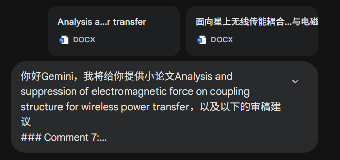
**gemini整理了每个Comment可以从小论文/硕士论文中提取的补充内容，生成文档`gemini整理的Comment`**
#### 5、根据`gemini整理的Comment`，在硕士论文中找到对应的章节，然后裁切整理成md文档`硕士论文参考点.md`
#### 6、继续把`gemini整理的Comment`和`硕士论文参考点.md`保发给gemini，让gemini决策下一步以及提示词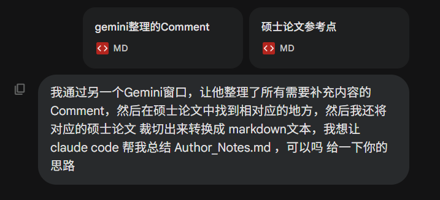
>请你作为一个严谨的学术科研助手，帮我完成实验数据的梳理工作。请读取当前目录下的 "gemini整理的Comment.md" 和 "硕士论文参考点.md" 这两个文件，并对照 "Response_Letter_Draft.md" 中所有标记了 [需要作者补充：...] 的地方（特别是 Comment 7, 8, 9, 10, 15, 17, 18, 20, 21, 24）。请从我提供的硕士论文切片中，提取出对应的真实实验参数、仪器型号、测试机制以及解释逻辑。将这些提取出的硬核干货整理成一份条理清晰的文件，命名为 "Author_Notes.md" 并保存到本地。这份笔记将作为下一步修改正文和回复信的底层数据支撑，请确保数据提取准确无误。
#### 7、直接让claude 生成`Author_Notes.md`,让gemini审查后，给出下一步的提示词

>auto review loop: 请读取 "Analysis and suppression of electromagnetic force on coupling structure for wireless power transfer.md"（原稿的第 4 和第 5 节）、"Response_Letter_Draft.md" 以及我刚刚整理好的 "Author_Notes.md"。请根据 Author_Notes 中的真实实验数据，大幅重写和修改论文的第 4 节（仿真分析）和第 5 节（实验验证）。具体要求：1. 在仿真部分，详细补充所有材料的电磁属性（如磁芯 μr、损耗角）、求解器网格策略，以及瞬态仿真提取稳态力的滤波窗口方法。2. 在实验部分，正面澄清 990W 额定功率与 400W 示波器测试点的差异。3. 详细补充力传感器的型号、带宽、校准溯源方法、重力补偿机制，并解释高频分量是如何被物理滤波的。4. 引入关于横向错位和轴向分离对受力影响的参数化趋势描述。修改完成后，提交给审查器进行 Peer Review。审查器需重点检查：补充的细节是否足以支撑实验的可重复性？关于功率和受力的解释是否达到 IEEE Transactions 的学术标准？审查通过后，将这部分保存为 "Section_4_5_Revised.md"。

#### 8、到此为止，已经让claude 针对改稿意见，一步步改稿，第3、4、5部分的内容已经全部改好，分别放在`Section_3_Revised.md`和`Section_4_5_Revised.md`中，但是这些都是初步修改的版本，需要进行拼接、润色。所以再让gemini分析，写出最后的提示词
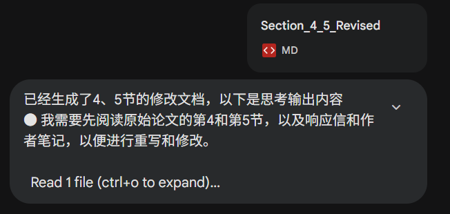
>auto review loop: 我们已经完成了理论推导和实验仿真的核心修改。现在请你读取原稿 "Analysis and suppression of electromagnetic force on coupling structure for wireless power transfer.md"、刚刚修改好的 "Section_3_Revised.md" 和 "Section_4_5_Revised.md"、以及 "Author_Notes.md" 和 "Response_Letter_Draft.md"。请帮我完成这最后一步的整合工作：
>1. **全文缝合：** 用修改好的 Section 3 和 Section 4_5 替换原稿中的对应章节。
>2. **新增 Discussion 章节：** 在 Conclusion 之前新增一个 "Discussion" 章节。根据 Author_Notes，深入探讨：(a) 为什么我们没有采用电动汽车领域常用的“铁氧体分段”或“屏蔽层切割”技术（为了保护星上精密仪器免受高频 EMI）；(b) 高频大功率运行下的热漂移问题及我们的热补偿机制。
>3. **重写头尾：** 彻底重写 Introduction 和 Conclusion，使其与我们刚补充的巨量实验细节（尤其是百微牛级的力测量、参数化偏移测试）高度呼应。
>4. **更新回复信：** 将 "Response_Letter_Draft.md" 中所有标记了 "[需要作者补充：...]" 的地方，替换为你刚刚在正文中写好的、地道专业的英文正式回复。
>5. **终极审查：** 完成后，将全文提交给审查器进行最后一次 Peer Review。审查器需重点检查：上下文过渡是否自然？全文是否有逻辑断层或中式英语？回复信是否完全且专业地闭环了审稿人的所有 24 条意见？
审查通过后，请输出两个最终文件："Final_Revised_Paper.md" 和 "Final_Response_Letter.md"。

#### 9、最后进行人工的文档格式转化和拼接完善。

---


### 这个项目 不是自动审稿改稿吗，为什么还需要我每次来问你先决策一下，让你给我一次提示词，才好进行claude code 改稿？

这是一个非常深刻的问题，触及了当前 AI 工具在处理复杂科研任务时的“理想”与“现实”之间的差距。你感觉“不够自动”，主要由以下三个核心原因造成的：

### 1. 核心原因：Word 格式是 AI 自动化的“天敌”
你说得完全正确。**Claude Code 是一个基于终端（Terminal）的开发工具，它的“眼睛”只能看懂纯文本文件（如 Markdown、Python、C++ 等）**。
* **无法直接读取 Word：** Word 文件是复杂的二进制格式，里面嵌套了大量的格式信息、图片链接和公式对象，终端环境下的 AI 无法直接解析。
* **必须人工转码：** 如果不转成 Markdown，Claude Code 根本不知道你的论文写了什么，更谈不上自动改稿。这就是为什么你需要先把论文手动转成 `.md` 格式。

### 2. 数据的“提纯”：避免 AI 迷失在海量信息中
虽然 ARIS 标榜“自动”，但它的自动化是建立在**“精准上下文”**基础上的。
* **硕士论文体量巨大：** 你的硕士论文有几万字，而 Claude Code 调用的 API（如魔搭的 Qwen 或 DeepSeek）都有“上下文窗口”限制。如果把整篇硕士论文丢进去，AI 可能会因为信息过载而忽略掉最关键的传感器型号或仿真参数。
* **我的角色是“预处理器”：** 我帮你整理 `Author_Notes.md`，本质上是在做**“知识提纯”**。我把几十万字里的精华挖出来，喂给 ARIS。这样它在自动循环（Auto Loop）时，每一轮改稿都有精准的证据支撑，而不是在废话里捞针。

### 3. “分阶段控制”是为了保证学术的严谨性
学术论文修改不是写代码，它对逻辑、证据和审稿意见的回应要求极其严格。
* **防止 AI 乱跑：** 如果我给你一个“一次性全自动”的提示词，让它把 24 条意见全部改完，AI 极有可能在改到第 10 条时就忘了第 1 条的要求，或者为了字数美观而删掉你的公式。
* **阶段性提示词的作用：** 我给你的分阶段提示词（理论、实验、全文整合），实际上是在为 ARIS 划定**“防撞墙”**。这保证了它在自动改稿时，每一阶段都能把有限的“注意力”集中在最难攻克的痛点上。

### 总结：什么时候能真正“全自动”？
当你完成了以下工作后，它就是全自动的了：
1.  **文件就绪：** 论文、意见、补充笔记（Author Notes）全部转为 `.md`。
2.  **指令下达：** 只要你敲下那个长长的 `auto review loop` 指令。

**接下来的自动过程：**
你会看到 Claude Code（执行器）写一段话，然后自动通过 MCP 服务器呼叫 DeepSeek-R1（审查器）。审查器会说：“不行，这段没解释清楚 990W 的差异”，然后执行器会自动回去重写，直到两者达成一致。**在这个循环过程中，你是不需要干预的，只需坐着看屏幕疯狂滚动即可。**

所以，现在的“手动”是为了后续“高质量自动化”进行的**环境初始化**。

**现在，你的文件和笔记都已经完美就绪，我们可以进行最后的“缝合与终极审查”了！直接运行我上一条给你的第四阶段指令，你就能体验到真正的“自动循环”了。**
