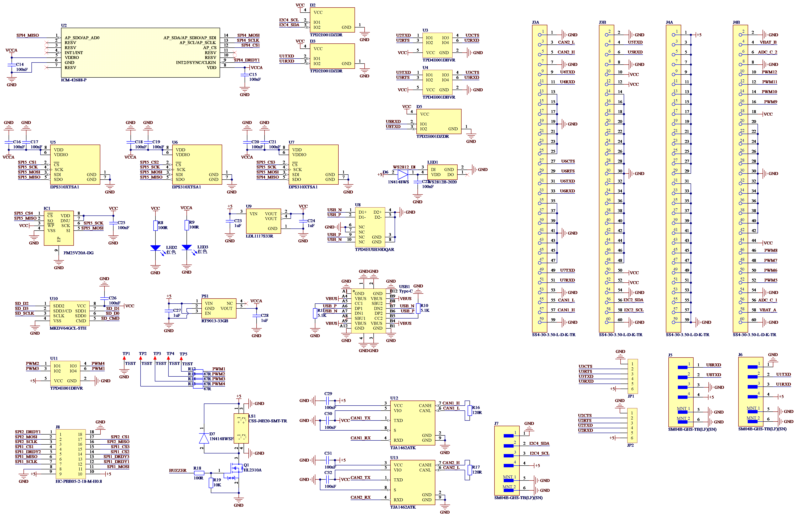

# APM 自定义固件编译与烧录

> *Jennifer Butler 编辑于 2026/1/23*

## 一、硬件说明

### 主要硬件

STM32H753IIK6、ICM-42688-P、DPS310、FM25V20A、MKDV01GCL、WS2812、TJA1462、ICM-45686、BMI088、RM3100

### 硬件定义表

| **MCU Pins** | **Net / Function**  | **Note**                                      |
| ------------ | ------------------- | --------------------------------------------- |
| PA0          | UART2_CTS           | On Main Board, Connect to MAVLink Passthrough |
| PA1          | UART2_RTS           | On Main Board, Connect to MAVLink Passthrough |
| PA2          | UART2_TXD           | On Main Board, Connect to MAVLink Passthrough |
| PA3          | UART2_RXD           | On Main Board, Connect to MAVLink Passthrough |
| PA5          | WS2812_DIN          | WS2812 Control                                |
| PA6          | PWM/DSHORT9         | On EXP Board, Recommended Use                 |
| PA7          | PWM/DSHORT10        | On EXP Board, Recommended Use                 |
| PA9          | VBUS_SENSING        | Connect to VBUS through 2.2K                  |
| PA10         | SPI2_CS             | Connect to RM3100 CS                          |
| PA11         | USB_DN              | USB_DM                                        |
| PA12         | USB_DP              | USB_DP                                        |
| PA13         | SWDIO               | SWD Debug Data                                |
| PA14         | SWCLK               | SWD Debug Clock                               |
| PA15         | SPI1_DRDY3          | Connect to BMI088 INT3                        |
| PB0          | PWM/DSHORT11        | On EXP Board, Recommended Use                 |
| PB1          | PWM/DSHORT12        | On EXP Board, Recommended Use                 |
| PB3          | SPI1_CS1            | Connect to ICM45686 CS                        |
| PB4          | SPI1_CS2            | Connect to BMI088 CSB1                        |
| PB5          | CAN2_RX             | On EXP & Main Board, With 120R Termination    |
| PB6          | CAN2_TX             | On EXP & Main Board, With 120R Termination    |
| PB8          | CAN1_RX             | On EXP & Main Board, With 120R Termination    |
| PB9          | CAN1_TX             | On EXP & Main Board, With 120R Termination    |
| PB10         | I2C2_SCL            | On EXP Board                                  |
| PB11         | I2C2_SDA            | On EXP Board                                  |
| PB12         | UART5_RXD           | On EXP Board, Without RTS/CTS                 |
| PB13         | UART5_TXD           | On EXP Board, Without RTS/CTS                 |
| PB14         | UART1_TXD           | On Main Board, Connect to ELRS as CRSF        |
| PB15         | UART1_RXD           | On Main Board, Connect to ELRS as CRSF        |
| PC4          | VBAT_Sensor_COM1    | Connect to External Analog Voltage Sensor 1   |
| PC5          | Current_Sensor_COM1 | Connect to External Analog Current Sensor 1   |
| PC6          | UART6_TXD           | On EXP Board                                  |
| PC7          | UART6_RXD           | On EXP Board                                  |
| PC8          | SDMMC_DATA0         | Connect to SD Nand Flash Data0                |
| PC9          | SDMMC_DATA1         | Connect to SD Nand Flash Data1                |
| PC10         | SDMMC_DATA2         | Connect to SD Nand Flash Data2                |
| PC11         | SDMMC_DATA3         | Connect to SD Nand Flash Data3                |
| PC12         | SDMMC_CLK           | Connect to SD Nand Flash SCLK                 |
| PC14         | OSC32_IN            | Connect to 32.768KHz Crystal                  |
| PC15         | OSC32_OUT           | Connect to 32.768KHz Crystal                  |
| PD0          | SPI1_DRDY1          | Connect to ICM45686 INT2                      |
| PD2          | SDMMC_CMD           | Connect to SD Nand Flash CMD                  |
| PD6          | SPI1_DRDY2          | Connect to BMI088 INT1                        |
| PD7          | SPI1_MOSI           | Connect to ICM45686 and BMI088 MOSI           |
| PD8          | UART3_TXD           | On Main Board, Connect to Jetson Board        |
| PD9          | UART3_RXD           | On Main Board, Connect to Jetson Board        |
| PD11         | UART3_CTS           | On Main Board, Connect to Jetson Board        |
| PD12         | UART3_RTS           | On Main Board, Connect to Jetson Board        |
| PD13         | PWM/DSHORT1         | On Main Board, For Backup (Not Recommended)   |
| PD14         | PWM/DSHORT2         | On Main Board, For Backup (Not Recommended)   |
| PE0          | UART8_RXD           | On Main Board, Connect to Nooploop UWB        |
| PE1          | UART8_TXD           | On Main Board, Connect to Nooploop UWB        |
| PE2          | SPI4_SCLK           | Connect to ICM42688 SCLK                      |
| PE3          | SPI4_CS1            | Connect to ICM42688 CS                        |
| PE4          | SPI4_DRDY1          | Connect to ICM42688 INT                       |
| PE5          | SPI4_MISO           | Connect to ICM42688 MISO                      |
| PE6          | SPI4_MOSI           | Connect to ICM42688 MOSI                      |
| PE7          | UART7_RXD           | On EXP Board, Without RTS/CTS                 |
| PE8          | UART7_TXD           | On EXP Board, Without RTS/CTS                 |
| PE9          | PWM/DSHORT5         | On EXP Board, Recommended Use                 |
| PE11         | PWM/DSHORT6         | On EXP Board, Recommended Use                 |
| PE13         | PWM/DSHORT7         | On EXP Board, Recommended Use                 |
| PE14         | PWM/DSHORT8         | On EXP Board, Recommended Use                 |
| PF3          | SPI5_CS1            | Connect to DPS310 1 CS                        |
| PF5          | SPI5_CS2            | Connect to DPS310 2 CS                        |
| PF6          | SPI5_CS3            | Connect to DPS310 3 CS                        |
| PF7          | SPI5_SCLK           | Connect to DPS310 (1/2/3) & FM25V20A SCLK     |
| PF8          | SPI5_MISO           | Connect to DPS310 (1/2/3) & FM25V20A MISO     |
| PF9          | SPI5_MOSI           | Connect to DPS310 (1/2/3) & FM25V20A MOSI     |
| PF10         | SPI5_CS4            | Connect to FM25V20A CS                        |
| PF11         | VBAT_Sensor_COM2    | Connect to External Analog Voltage Sensor 2   |
| PF12         | Current_Sensor_COM2 | Connect to External Analog Current Sensor 2   |
| PF14         | I2C4_SCL            | Connect to External INA226 SCL                |
| PF15         | I2C4_SDA            | Connect to External INA226 SDA                |
| PG0          | VER_REV_Drive       | PX4 Hardware VER/REV Drive                    |
| PG8          | UART6_RTS           | On EXP Board                                  |
| PG9          | SPI1_MISO           | Connect to ICM45686 and BMI088 MISO           |
| PG10         | SPI1_CS3            | Connect to BMI088 CSB2                        |
| PG11         | SPI1_SCLK           | Connect to ICM45686 and BMI088 SCLK           |
| PG13         | UART6_CTS           | On EXP Board                                  |
| PH0          | OSC_IN              | Connect to 8MHz Crystal                       |
| PH1          | OSC_OUT             | Connect to 8MHz Crystal                       |
| PH3          | VER                 | PX4 Hardware VER Identification               |
| PH4          | REV                 | PX4 Hardware REV Identification               |
| PH10         | PWM/DSHORT3         | On Main Board, For Backup (Not Recommended)   |
| PH11         | PWM/DSHORT4         | On Main Board, For Backup (Not Recommended)   |
| PH13         | UART4_TXD           | On EXP Board, Without RTS/CTS                 |
| PH14         | UART4_RXD           | On EXP Board, Without RTS/CTS                 |
| PI0          | SPI2_DRDY1          | Connect to RM3100 INT                         |
| PI1          | SPI2_SCLK           | Connect to RM3100 SCLK                        |
| PI2          | SPI2_MISO           | Connect to RM3100 MISO                        |
| PI3          | SPI2_MOSI           | Connect to RM3100 MOSI                        |
| PI7          | Buzzer              | Connect to Passive Buzzer                     |

### 原理图





## 二、步骤

### (一)环境准备

1. **安装WSL2 Ubuntu24.04**

   - 在 Windows 11 终端中输入以下命令安装

     ```cmd
     wsl.exe --install Ubuntu-24.04
     ```

2. **Windows 下安装 [VS Code](https://code.visualstudio.com/)**

3. **WSL2 Ubuntu 下安装 git gitk git-gui**

   - 在 Ubuntu 终端中输入以下命令安装

     ```bash
     sudo apt update
     sudo apt upgrade
     sudo apt install git gitk git-gui
     ```

4. **克隆项目源码**

   - 在 Ubuntu 终端中输入以下命令克隆

     ```bash
     git clone https://github.com/ArduPilot/ardupilot.git
     ```

5. **配置工作环境**
   - 在 VS Code 中点击`远程`按键，选择`WSL`，选择安装的 Ubuntu-24.04，等待目录切换完成
   - 在 VS Code 中 `File -> Open Folder` 打开 `ardupilot` 文件夹
   - 切换到 master 分支

6. **安装必要依赖**

   - 打开终端 (`Ctrl + ~`)

   -   输入以下命令安装依赖

       ```bash
       sudo apt-get update
       sudo apt-get install -y binutils-arm-none-eabi gcc-arm-none-eabi
       chmod 777 ./Tools/environment_install/install-prereqs-ubuntu.sh
       ./Tools/environment_install/install-prereqs-ubuntu.sh -y
       . ~/.profile
       ```

   -   等待终端输出

       ```bash
       ---------- ./Tools/environment_install/install-prereqs-ubuntu.sh end ----------
       ```

       依赖安装成功

   -   强烈建议安装 `ARDUPILOT DEVENV` 扩展以检查依赖和工具是否齐全，如有缺失工具和依赖一定要补齐

### (二)创建硬件配置文件并修正固件 Bug

1. 在`AP_HAL_ChibiOS/hwdef`文件夹下创建`AP_H753_Custom`文件夹

2. 在`AP_H753_Custom`文件夹中创建`hwdef-bf.dat`，`defaults.parm`和`hwdef.dat`3个文件

3. 在`hwdef-bl.dat`中填入

   ```ini
   MCU STM32H7xx STM32H753xx
   
   FLASH_SIZE_KB 2048
   FLASH_RESERVE_START_KB 0
   FLASH_BOOTLOADER_LOAD_KB 128
   APP_START_OFFSET_KB 128
   
   # Crystal configuration
   OSCILLATOR_HZ 8000000
   
   # Board ID
   APJ_BOARD_ID 1098
   
   # UART2 Debug
   PA2 USART2_TX USART2
   PA3 USART2_RX USART2
   
   # UART Order
   SERIAL_ORDER USART2
   
   # Bootloader settings
   define HAL_BOOTLOADER_TIMEOUT 4000
   define HAL_USE_SERIAL TRUE
   
   # SD Card support in bootloader (Optional, but good for reliable flashing)
   PC8  SDMMC1_D0 SDMMC1
   PC9  SDMMC1_D1 SDMMC1
   PC10 SDMMC1_D2 SDMMC1
   PC11 SDMMC1_D3 SDMMC1
   PC12 SDMMC1_CK SDMMC1
   PD2  SDMMC1_CMD SDMMC1
   define HAL_USE_SDC TRUE
   
   # Enable FATFS for SD Firmware Update
   define HAL_OS_FATFS_IO 1
   
   # USB
   PA11 OTG_FS_DM OTG1
   PA12 OTG_FS_DP OTG1
   USB_VENDOR 0x1209
   USB_PRODUCT 0x5741
   USB_STRING_MANUFACTURER "Custom"
   USB_STRING_PRODUCT "AP_H753_Custom"
   ```

4. 在`hwdef.dat`中填入

   ```ini
   # MCU class and specific type
   MCU STM32H7xx STM32H753xx
   
   # Crystal configuration
   OSCILLATOR_HZ 8000000
   
   # Board ID
   APJ_BOARD_ID 1098
   
   # Bootloader offset
   FLASH_SIZE_KB 2048
   FLASH_RESERVE_START_KB 128
   
   # USB Config
   USB_VENDOR 0x1209
   USB_PRODUCT 0x5741
   USB_STRING_MANUFACTURER "Custom"
   USB_STRING_PRODUCT "AP_H753_Custom"
   
   # UART Order
   SERIAL_ORDER OTG1 USART2 USART3 USART4 USART5 USART6 USART7 USART8 USART1
   
   # I2C Order (I2C2 on EXP, I2C4 on Main for INA226)
   I2C_ORDER I2C2 I2C4
   
   # -- UARTs --
   # UART1 (Main Board: CRSF / RC)
   PB14 USART1_TX USART1
   PB15 USART1_RX USART1
   
   # UART2 (Main Board: MAVLink Pass-through)
   PA2 USART2_TX USART2
   PA3 USART2_RX USART2
   
   # UART3 (Main Board: Jetson Board)
   PD8 USART3_TX USART3
   PD9 USART3_RX USART3
   
   # UART4 (EXP Board)
   PH13 UART4_TX UART4
   PH14 UART4_RX UART4
   
   # UART5 (EXP Board)
   PB13 UART5_TX UART5
   PB12 UART5_RX UART5
   
   # UART6 (EXP Board)
   PC6 USART6_TX USART6
   PC7 USART6_RX USART6
   # PG8 UART6_RTS USART6
   # PG13 USART6_CTS USART6
   
   # UART7 (EXP Board)
   PE8 UART7_TX UART7
   PE7 UART7_RX UART7
   
   # UART8 (Main Board: Nooploop UWB)
   PE1 UART8_TX UART8
   PE0 UART8_RX UART8
   
   # -- USB --
   PA11 OTG_FS_DM OTG1
   PA12 OTG_FS_DP OTG1
   PA9  VBUS INPUT OPCODE(0)
   
   # -- SWD --
   PA13 SWDIO SWD
   PA14 SWCLK SWD
   
   # -- CAN --
   # CAN1/CAN2
   PB9 CAN1_TX CAN1
   PB8 CAN1_RX CAN1
   PB6 CAN2_TX CAN2
   PB5 CAN2_RX CAN2
   
   # -- I2C --
   PB10 I2C2_SCL I2C2
   PB11 I2C2_SDA I2C2
   PF14 I2C4_SCL I2C4
   PF15 I2C4_SDA I2C4
   
   # -- SPI Pin Definitions --
   # SPI1 (ICM45686, BMI088)
   PG11 SPI1_SCK SPI1
   PG9  SPI1_MISO SPI1
   PD7  SPI1_MOSI SPI1
   PB3  ICM45686_CS CS
   PB4  BMI088_A_CS CS
   PG10 BMI088_G_CS CS
   
   # SPI2 (RM3100)
   PI1 SPI2_SCK SPI2
   PI2 SPI2_MISO SPI2
   PI3 SPI2_MOSI SPI2
   PA10 RM3100_CS CS
   
   # SPI4 (ICM42688)
   PE2 SPI4_SCK SPI4
   PE5 SPI4_MISO SPI4
   PE6 SPI4_MOSI SPI4
   PE3 ICM42688_CS CS
   
   # SPI5 (DPS310 x3, FRAM)
   PF7 SPI5_SCK SPI5
   PF8 SPI5_MISO SPI5
   PF9 SPI5_MOSI SPI5
   PF3  DPS310_1_CS CS
   PF5  DPS310_2_CS CS
   PF6  DPS310_3_CS CS
   PF10 FRAM_CS CS
   
   # -- DRDY Types --
   PD0  ICM45686_DRDY INPUT
   PD6  BMI088_A_DRDY INPUT
   PA15 BMI088_G_DRDY INPUT
   PI0  RM3100_DRDY   INPUT
   PE4  ICM42688_DRDY INPUT
   
   # -- ADC (Batt) --
   PC4  BATT_VOLT_SENS ADC1 SCALE(1)
   PC5  BATT_CURR_SENS ADC1 SCALE(1)
   PF11 BATT2_VOLT_SENS ADC1 SCALE(1)
   PF12 BATT2_CURR_SENS ADC1 SCALE(1)
   
   # -- PWM --
   # Main (Backup)
   PD13 TIM4_CH2 TIM4 PWM(1) GPIO(50)
   PD14 TIM4_CH3 TIM4 PWM(2) GPIO(51)
   PH10 TIM5_CH1 TIM5 PWM(3) GPIO(52)
   PH11 TIM5_CH2 TIM5 PWM(4) GPIO(53)
   # EXP
   PE9  TIM1_CH1 TIM1 PWM(5) GPIO(54)
   PE11 TIM1_CH2 TIM1 PWM(6) GPIO(55)
   PE13 TIM1_CH3 TIM1 PWM(7) GPIO(56)
   PE14 TIM1_CH4 TIM1 PWM(8) GPIO(57)
   # EXP/Main
   PA6  TIM3_CH1 TIM3 PWM(9)  GPIO(58)
   PA7  TIM3_CH2 TIM3 PWM(10) GPIO(59)
   PB0  TIM3_CH3 TIM3 PWM(11) GPIO(60)
   PB1  TIM3_CH4 TIM3 PWM(12) GPIO(61)
   # NeoPixel
   PA5  TIM8_CH1N TIM8 PWM(13) GPIO(62)
   
   # -- Storage --
   PC8  SDMMC1_D0 SDMMC1
   PC9  SDMMC1_D1 SDMMC1
   PC10 SDMMC1_D2 SDMMC1
   PC11 SDMMC1_D3 SDMMC1
   PC12 SDMMC1_CK SDMMC1
   PD2  SDMMC1_CMD SDMMC1
   define HAL_USE_SDC TRUE
   define HAL_STORAGE_SIZE 32768
   define HAL_WITH_RAMTRON 1
   
   # -- OSC/Misc --
   # PC14 OSC32_IN OSC32
   # PC15 OSC32_OUT OSC32
   # PH0  OSC_IN OSC
   # PH1  OSC_OUT OSC
   PG0 BOARD_VER_DRIVE OUTPUT LOW
   PH3 BOARD_VER_ID INPUT
   PH4 BOARD_REV_ID INPUT
   PI7 BUZZER OUTPUT GPIO(80)
   define FAILSAFE_BUZZER_PIN 80
   
   # -- SPIDEV Table --
   SPIDEV icm45686   SPI1 DEVID1 ICM45686_CS MODE3 2*MHZ 8*MHZ
   SPIDEV bmi088_a   SPI1 DEVID2 BMI088_A_CS MODE3 10*MHZ 10*MHZ
   SPIDEV bmi088_g   SPI1 DEVID3 BMI088_G_CS MODE3 10*MHZ 10*MHZ
   SPIDEV rm3100     SPI2 DEVID1 RM3100_CS   MODE3 2*MHZ 8*MHZ
   SPIDEV icm42688   SPI4 DEVID1 ICM42688_CS MODE3 2*MHZ 8*MHZ
   SPIDEV dps310_1   SPI5 DEVID1 DPS310_1_CS MODE3 5*MHZ 5*MHZ
   SPIDEV dps310_2   SPI5 DEVID2 DPS310_2_CS MODE3 5*MHZ 5*MHZ
   SPIDEV dps310_3   SPI5 DEVID3 DPS310_3_CS MODE3 5*MHZ 5*MHZ
   SPIDEV ramtron    SPI5 DEVID4 FRAM_CS     MODE3 8*MHZ 8*MHZ
   
   # -- Sensor Drivers & Auto-Detection --
   IMU Invensense SPI:icm45686 ROTATION_NONE
   IMU BMI088 SPI:bmi088_a SPI:bmi088_g ROTATION_YAW_90
   IMU Invensense SPI:icm42688 ROTATION_PITCH_180
   COMPASS RM3100 SPI:rm3100 false ROTATION_NONE
   BARO DPS310 SPI:dps310_1
   BARO DPS310 SPI:dps310_2
   BARO DPS310 SPI:dps310_3
   
   # -- Defines --
   define HAL_BATTMON_INA2XX_BUS 1
   define HAL_BATTMON_INA2XX_ADDR 0
   define HAL_GCS_ENABLED 1
   define STM32_ST_USE_TIMER 2
   define AP_CRASHDUMP_ENABLED 0
   define STM32_USART4_RX_DMA_CONFIG STM32_UART4_RX_DMA_CONFIG
   define STM32_USART4_TX_DMA_CONFIG STM32_UART4_TX_DMA_CONFIG
   define STM32_USART5_RX_DMA_CONFIG STM32_UART5_RX_DMA_CONFIG
   define STM32_USART5_TX_DMA_CONFIG STM32_UART5_TX_DMA_CONFIG
   define STM32_USART7_RX_DMA_CONFIG STM32_UART7_RX_DMA_CONFIG
   define STM32_USART7_TX_DMA_CONFIG STM32_UART7_TX_DMA_CONFIG
   define STM32_USART8_RX_DMA_CONFIG STM32_UART8_RX_DMA_CONFIG
   define STM32_USART8_TX_DMA_CONFIG STM32_UART8_TX_DMA_CONFIG
   ```

5. 在`defaults.parm`中填入

   ```ini
   # Setup NeoPixel
   SERVO13_FUNCTION 120
   NTF_LED_TYPES 455
   
   # Setup CAN
   # CAN1 for ESCs (dronecan)
   CAN_P1_DRIVER 1
   CAN_D1_PROTOCOL 1
   CAN_P1_BITRATE 1000000
   
   # CAN2 for Node Board (dronecan)
   CAN_P2_DRIVER 1
   CAN_D2_PROTOCOL 1
   CAN_P2_BITRATE 1000000
   
   # Battery Monitor 1 (External Analog on PC4/PC5)
   BATT_MONITOR 4
   BATT_VOLT_PIN 4
   BATT_CURR_PIN 8
   
   # Battery Monitor 2 (External Analog on PF11/PF12)
   BATT2_MONITOR 4
   BATT2_VOLT_PIN 2
   BATT2_CURR_PIN 6
   
   # Battery Monitor 3 (External I2C INA226 on I2C4)
   BATT3_MONITOR 21
   BATT3_I2C_BUS 1
   
   # Serial Protocols
   SERIAL1_PROTOCOL 2  # UART2 (MAVLink Pass-through Board)
   SERIAL2_PROTOCOL 2  # UART3 (Jetson Board)
   SERIAL2_BAUD 921600 # High baud for companion
   SERIAL7_PROTOCOL 5  # UART8 (Nooploop UWB - GPS Protocol)
   SERIAL8_PROTOCOL 23 # UART1 (ELRS as CRSF)
   ```

6. **修正头文件引用路径及脚本权限**

   - 修改 `libraries/GCS_MAVLink/GCS_MAVLink.h` 以解决头文件路径问题
     将原来的：
     
     ```cpp
     #include <mavlink/v2.0/all/version.h>
     // ...
     #include <mavlink/v2.0/mavlink_types.h>
     // ...
     #include "../../modules/mavlink/include/mavlink/v2.0/all/mavlink.h"
     ```
     修改为：
     ```cpp
     #include "include/mavlink/v2.0/all/version.h"
     // ...
     #include "include/mavlink/v2.0/mavlink_types.h"
     // ...
     #include "include/mavlink/v2.0/all/mavlink.h"
     ```
     
   - 为 hex 生成脚本添加执行权限
     在终端中执行：
     ```bash
     chmod +x Tools/scripts/make_intel_hex.py
     ```

### (三)编译 Bootloader 及 Copter 固件

在终端中输入以下命令，首先清理环境，然后配置并编译 Bootloader，最后编译 Copter 固件,构建系统将会自动将 Bootloader 打包进固件中

```bash
./waf distclean
./waf configure --board AP_H753_Custom --bootloader && ./waf bootloader
cp build/AP_H753_Custom/bin/AP_Bootloader.bin Tools/bootloaders/AP_H753_Custom_bl.bin
./waf configure --board AP_H753_Custom && ./waf copter
```

等待编译结束，终端打印类似以下信息即表示成功

```bash
No APP_DESCRIPTOR found
[1249/1251] apj_gen build/AP_H753_Custom/bin/arducopter.bin
[1250/1251] bin cleanup build/AP_H753_Custom/bin/arducopter.bin
[1251/1251] Generating bin/arducopter_with_bl.hex
Waf: Leaving directory `/home/jennifer/ardupilot/build/AP_H753_Custom'

BUILD SUMMARY
Build directory: /home/jennifer/ardupilot/build/AP_H753_Custom
Target          Text (B)  Data (B)  BSS (B)  Total Flash Used (B)  Free Flash (B)  External Flash Used (B)
----------------------------------------------------------------------------------------------------------
bin/arducopter   1469912      3520   129800               1473432          492636  Not Applicable         

'copter' finished successfully (38.278s)
```

## 三、烧录固件

  - 使用 ST-Link 或者 J-Link 和 4Pin 1.5mm 间距 PCB 测试夹连接飞控板与电脑，确保节点板已经上电

  - 打开 `STM32CubeProgrammer`，点击 `Connect` 连接
  - 通过 `Open File` 加载生成的固件文件 `arducopter_with_bl.hex`
  - 点击 `Download` 烧录
  - 重启飞控板

## 四、调试

  1. 连接地面站
     - 使用 USB 线连接飞控与电脑
     - 打开 Mission Planner 或 QGroundControl
     - 应该能识别到 COM 口并连接

  2. MAVLink 检查
     - 如果使用串口连接 (UART2/Serial1)，波特率默认为 57600
     - 连接成功后应能看到姿态数据刷新
