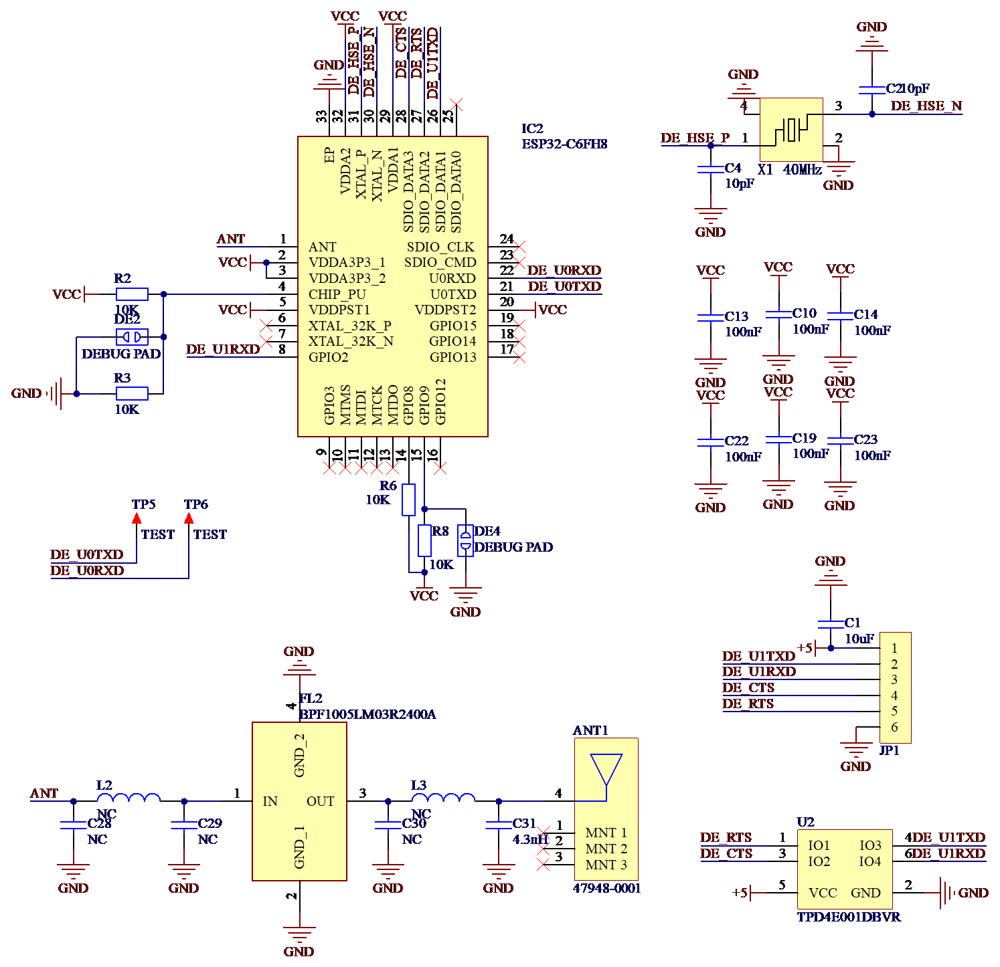

# DroneBridge 自定义固件烧录

> *Jennifer Butler 编辑于 2026/1/23*

## 一、硬件说明

### 主要硬件

ESP32-C6FH4

### 引脚定义表

| MCU Pins | 功能 |      Note       |
| :------: | :--: | :-------------: |
| GPIO 17  |  RX  | Debug RX(UART0) |
| GPIO 16  |  TX  | Debug TX(UART0) |
|  GPIO 2  |  RX  |    UART1 RX     |
| GPIO 21  |  TX  |    UART1 TX     |
| GPIO 22  | RTS  |    UART1 RTS    |
| GPIO 23  | CTS  |    UART1 CTS    |

### 原理图

## 二、烧录步骤

### （1）进入BOOT模式

1.   将 USB-TTL 模块连接到 ESP32-C6
     *   TTL TX -> ESP32 UART0 RX   
     *   TTL RX -> ESP32 UART0 TX   
     *   GND -> GND  
     *   3.3V -> 3.3V  
2.   进入 Boot 模式：先短接 BOOT 断点调试焊盘，然后上电，断开断点调试焊盘  

### （2）烧录固件

1.  打开[在线固件烧录网站](https://drone-bridge.com/flasher/)
2.  点击 `Connect to ESP32` 按键，选择对应端口
3.  选择最新版本固件，目标器件选择ESP32-C6，点击烧录
4.  待烧录完成后重新启动ESP32-C6

## 三、参数配置

1. 连接到WiFi `DroneBridge for ESP32`，密码为`dronebridge` 
2. 浏览器地址栏输入网址<http://192.168.2.1/>
3. 进入如下界面：

5. 配置如下选项

   - ESP32 Mode: WiFi Cilent Mode

   - SSID: 填写要连接的路由器SSID名称（只支持2.4G）

   - Password: 填写要连接的路由器密码

   - UART TX Pin: 21

   - UART RX Pin: 2

   - UART RTS Pin: 22

   - UART CTS Pin: 23

   - UART baud: 921600

​	其余选项保持默认，注意飞控端连接端口修改至相同波特率，Mavlink协议并开启硬件流控

5. 点击`SAVE SETTINGS & REBOOT`按键，等待ESP32-C6重启后连接到与ESP32-C6相同的路由器下
6. 浏览器地址栏输入`http://ESP32-C6 IP地址/`可重新进入前面的管理页面
7. 更多配置参考[Dronebridge 官方 Wiki](https://dronebridge.gitbook.io/docs/dronebridge-for-esp32/configuration)