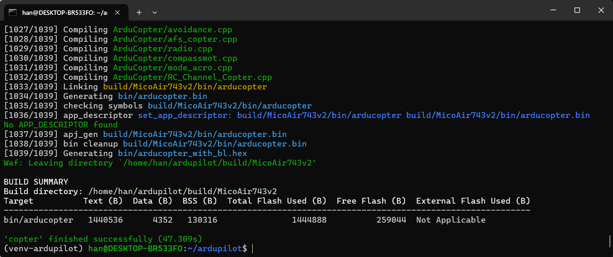

# 0.APM环境搭建及固件编译

> *Hahngao 首次编辑于 2026/1/26


## 一、AMP环境搭建及固件编译步骤
### (一)环境准备

1. **安装WSL2 Ubuntu24.04**

   - 在 Windows 11 终端中输入以下命令安装

     ```cmd
     # 如果重装，需要先注销已安装的WSL2发行版 wsl --unregister Ubuntu-24.04 
     wsl.exe --install Ubuntu-24.04
     ```
     
   - 安装之后，如果没有完成用户名和密码的配置。还需要进去执行一遍
     
       ```cmd
       wsl.exe -d Ubuntu-24.04
       ```

   

   - *注意以上过程，wsl安装出错，可能是网络问题，挂TZ容易中断，也可能是需要wsl注销重新安装*


3. **WSL2 Ubuntu 下安装 git gitk git-gui**。以后为了避免每次git输入用户密码，可以使用：git config --global credential.helper store

   - 在 Ubuntu 终端中输入以下命令安装

     ```bash
      # 更新可用软件包列表，从软件源获取最新的版本信息
      sudo apt update
      
      # 升级所有已安装的软件包到最新版本
      sudo apt upgrade
      
      # 安装Git版本控制系统及相关图形化工具：
      # git - 核心版本控制工具
      # gitk - Git仓库可视化浏览器（基于Tk）
      # git-gui - Git图形化界面工具
      sudo apt install git gitk git-gui
     ```

4. **克隆项目源码，选择稳定分支**

   - 在 Ubuntu 终端中输入以下命令克隆，挂TZ容易中断，可以尝试SSH。配置方法：[github配置SSH-Key保姆级教程 - 知乎](https://zhuanlan.zhihu.com/p/688103044)

     ```bash
     git clone https://github.com/ArduPilot/ardupilot.git
     =======
     # git clone git@github.com:ArduPilot/ardupilot.git    
     ```

4. **配置工作环境，可选VSCode或者Trae。以下是VScode示例**
   
   - 在 VS Code 中点击`远程`按键，选择`WSL`，选择安装的 Ubuntu-22.04，等待目录切换完成
   - 在 VS Code 中 `File -> Open Folder` 打开 `ardupilot` 文件夹
   - 切换到 master 分支，只有master才可以使用siti仿真
   - *部分操作在 Ubuntu 终端是可以，但方便后续AI代码开发，才选择在IDE（VSCode）上*
   
5. **安装必要依赖**

   - 打开VScode的终端 (`Ctrl + ~`)

   - 输入以下命令安装依赖，先强制更新子模块，确保waf下载，建议逐行运行。

     ```bash
     sudo apt-get update
     sudo apt-get install -y binutils-arm-none-eabi gcc-arm-none-eabi
     git submodule update --init --recursive --force
     chmod 777 ./Tools/environment_install/install-prereqs-ubuntu.sh
     ./Tools/environment_install/install-prereqs-ubuntu.sh -y
     . ~/.profile
     ```

   -   如何某个子模块使用update无法下载，可以进入module目录下，直接使用git clone。

       - 例如：~/ardupilot/modules$ git clone https://github.com/ArduPilot/ChibiOS.git
       
   - 耐心等待终端输出，需要TZ，但某些子模块更新的时候挂TZ会不成功

   

   
     依赖安装成功

   - 强烈建议安装 `ARDUPILOT DEVENV` 扩展以检查依赖和工具是否齐全，如有缺失工具和依赖一定要补齐

### (二)编译 Copter 固件（以MicoAir743v2为例）
​	在终端中输入以下命令，首先清理环境，如果是自定义固件需要配置并编译 Bootloader，最后编译 Copter 固件,构建系统将会自动将 Bootloader 打包进固件中。以微空科技的飞控板为例，直接编译即可。

```bash
	./waf distclean
	./waf configure --board MicoAir743v2 && ./waf copter
```




